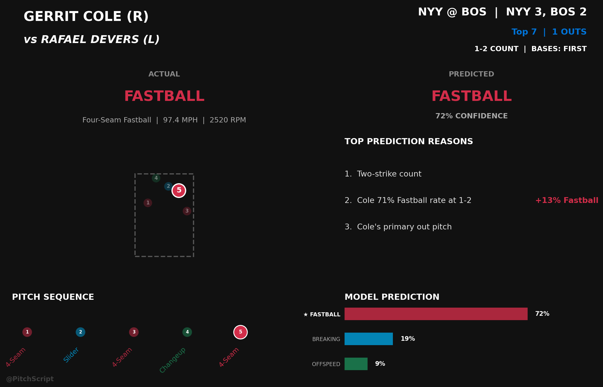

# PitchScript

> A live MLB game analysis bot that predicts pitch type in real time, measures how surprising each pitch was, and posts data-driven commentary to Twitter/X when something statistically unusual happens.

**[@PitchScript on X](https://x.com/PitchScript)** · **[W&B project](https://wandb.ai/offscriptpitch-/PitchBot/workspace?nw=2yjbv7hbt0w)**



---

## What it does

Most baseball bots report *what* happened. This one asks *how surprising was it?*

The bot polls the MLB Stats API every 30 seconds. For each pitch thrown, it:

1. **Predicts** the probability of each pitch family (Fastball / Breaking / Offspeed) given the pitcher's tendencies, the count, the matchup, and game context
2. **Measures surprisal** — the information-theoretic shock value of the actual pitch: `−log₂(P(actual_pitch))` in bits
3. **Generates a real-time infographic** with the pitch location, at-bat sequence, prediction breakdown, and the signals that drove the prediction
4. **Tweets** when a high-surprisal pitch (≥ 2.5 bits) results in a strikeout or a hard-hit ball

### Tweet narratives

| Situation | Trigger | Label |
|---|---|---|
| 🥶 Frozen | Looking strikeout on unexpected pitch | `Frozen!` |
| 🔀 Fooled | Swinging strikeout on unexpected pitch | `Fooled him!` |
| 😤 Dominance | Strikeout on an 80%+ probability fastball | `Pure Dominance.` |
| 🤯 Unbelievable | High surprisal strikeout, any pitch | `Unbelievable K!` |

---

## Model

**XGBoost multi-class classifier** (`multi:softprob`) — 3 classes: Fastball, Breaking, Offspeed.

### Feature design

The dominant signal is **pitcher-specific count tendency**: how often a given pitcher throws each pitch family at a specific count (e.g. "Wheeler throws sinkers 68% of the time on 0-0"). This single feature encodes both pitcher identity and count context, which lets the model focus on deviations rather than relearning MLB-wide count patterns from scratch.

| Feature group | Description |
|---|---|
| `tendency_count_*_pct` | Pitcher's pitch-family frequency at this exact count |
| `tendency_global_*_pct` | Pitcher's overall repertoire mix |
| `tendency_batter_count_*_pct` | How this batter is typically attacked at this count |
| `delta_count_*` | Pitcher deviation from league average at this count |
| `is_platoon_advantage` | Same-handedness matchup (switch hitters always = 1) |
| `is_leverage` | High-stakes count flag (2-strike or 3-ball) |
| `*_streak` | Consecutive same-family pitches in the at-bat |
| `pitch_count_in_game` | Pitcher fatigue proxy |

### Key engineering decisions

**Leave-one-out encoding for training.** Tendency features are computed over the full dataset, which would cause target leakage if used naively during training (the current row's label is baked into its own tendency percentage). During training, the function `_apply_loo_encoding` inverts the Laplace smoothing formula to subtract each row's contribution before computing the feature — so training sees the same distribution that inference sees at prediction time.

**Sample-size-weighted tendency blending.** At inference time the model's raw probability is blended with the pitcher's stated count tendency using a weight of `count_n / (count_n + 30)`. A pitcher with 60 pitches at a specific count gets 67% weight on their tendency; a pitcher with 5 gets 14%. This prevents the model from over-trusting sparse samples while still personalizing predictions for pitchers with deep history.

**Minimum pitcher sample gate.** Predictions are discarded (not tweeted) if the pitcher has fewer than 75 historical pitches in the baseline. Below that threshold the tendency features collapse to league averages, which produces confident-looking but meaningless predictions.

### Training pipeline

- **Data**: MLB Stats API pitch-level data, Regular Season + Postseason only
- **Split**: Chronological 80/20 — no future data leaks into training
- **Sample weights**: `sqrt(inverse class frequency)` × 2× leverage weight at 2-strike/3-ball counts
- **Baseline tendencies**: Built from training set only, Laplace-smoothed for sparse counts

### Performance

| Class | Precision | Recall | F1 |
|---|---|---|---|
| Fastball | ~0.70 | ~0.73 | ~0.71 |
| Breaking | ~0.64 | ~0.65 | ~0.64 |
| Offspeed | ~0.62 | ~0.64 | ~0.63 |
| **Overall accuracy** | | | **~57%** |
| **Balanced accuracy** | | | **~67%** |

Chance for a 3-class problem is 33%. The harder baseline — always predicting Fastball — achieves ~52% accuracy but ~33% balanced accuracy, since it entirely misses Breaking and Offspeed.

---

## Stack

| Layer | Tool |
|---|---|
| ML | XGBoost, scikit-learn |
| Data | MLB Stats API (`statsapi`), SQLite |
| Visualization | Matplotlib |
| Social | Twitter/X API v2 (`tweepy`) |
| Experiment tracking | Weights & Biases |
| Package management | `uv` |
| Scheduling | `launchd` (tracker), `cron` (retrain + monitoring) |

---

## Project structure

```
src/
├── bot/
│   ├── live_game_tracker.py      # Main polling loop — inference, gating, tweet dispatch
│   ├── visualization.py          # Pitch infographic generation (Matplotlib)
│   ├── nightly_monitor.py        # Daily W&B health logging
│   ├── bot.py                    # Tweet formatting and Twitter API client
│   └── signal_labels.py          # Human-readable prediction reason strings
├── model/
│   ├── train_model.py            # Full training pipeline with W&B logging
│   ├── inference.py              # PitchPredictor — hydration, blending, probability floor
│   └── calibration.py            # Isotonic calibration wrapper (optional post-training step)
├── features/
│   ├── baseline_manager.py       # Tendency hydration, LOO encoding, delta features
│   ├── features.py               # Contextual feature engineering (streaks, leverage, etc.)
│   ├── build_baseline_tendencies.py  # Pre-computes pitcher/batter/league tendency lookups
│   └── batter_tendency_processing.py # Batter whiff/chase metrics from Statcast
├── data/
│   ├── api_extractors.py         # MLB Stats API → structured pitch rows
│   ├── dataset_generator.py      # Bulk historical data pull and storage
│   └── database.py               # SQLite read/write layer
└── constants.py                  # Thresholds, model paths, pitch codes, league priors

scripts/
└── generate_samples.py           # Renders sample infographics from hardcoded scenarios

notebooks/
└── model_monitoring.ipynb        # Ad-hoc calibration and accuracy analysis
```

---

## Running locally

### Setup

```bash
git clone https://github.com/YOUR_USERNAME/mlb-pitch-bot.git
cd mlb-pitch-bot
uv sync
cp .env.example .env  # fill in API keys
```

### Required environment variables

```
TWITTER_CONSUMER_KEY=
TWITTER_CONSUMER_SECRET=
TWITTER_ACCESS_TOKEN=
TWITTER_ACCESS_TOKEN_SECRET=
WANDB_API_KEY=
WANDB_PROJECT=mlb-pitch-bot
```

Twitter credentials require a Developer account with OAuth 1.0a Read+Write access. W&B is optional — the tracker and trainer run fine without it, they just won't log metrics.

### Build the dataset and train

```bash
# Pull recent game data into SQLite
uv run python -m src.data.dataset_generator --days 14

# Pre-compute pitcher/batter/league tendency lookups
uv run python -m src.features.build_baseline_tendencies

# Train the model and log results to W&B
uv run python -m src.model.train_model
```

Or run the full pipeline at once:

```bash
./retrain_pipeline.sh
```

### Start the live tracker

```bash
# Foreground (Ctrl-C to stop)
uv run python -m src.bot.live_game_tracker

# Persistent via launchd (macOS — auto-restarts on crash)
launchctl load ~/Library/LaunchAgents/com.mlb-pitch-bot.tracker.plist
launchctl unload ~/Library/LaunchAgents/com.mlb-pitch-bot.tracker.plist
```

### Nightly monitoring

```bash
uv run python -m src.bot.nightly_monitor              # logs today's date
uv run python -m src.bot.nightly_monitor --date 2026-04-14
uv run python -m src.bot.nightly_monitor --dry-run    # preview without pushing to W&B
```

### Render sample infographics

```bash
uv run python scripts/generate_samples.py
# → output/sample_{1,2,3}.png
```

---

## Monitoring

All training runs and nightly summaries log to the [W&B project](https://wandb.ai/offscriptpitch-/PitchBot/workspace?nw=2yjbv7hbt0w).

**Training runs** (`job_type=training`)
- Accuracy, balanced accuracy, Brier score, per-class precision/recall/F1
- Confusion matrix, calibration curve, feature importance (top 30)
- Class distribution (train vs test), predicted probability histogram

**Nightly runs** (`job_type=nightly-monitoring`)
- Prediction validity rate, overall accuracy, tweet rate, mean surprisal
- Calibration gap per pitch family
- Per-pitcher error rate table
- Accuracy broken down by count situation

---

## Automation

| Job | Schedule | Mechanism |
|---|---|---|
| Live tracker | On demand / game days | `launchd` plist |
| Weekly retrain | Mondays 6 AM | `cron` → `retrain_pipeline.sh` |
| Nightly monitoring | 1 AM | `cron` → `nightly_monitor.py` |
